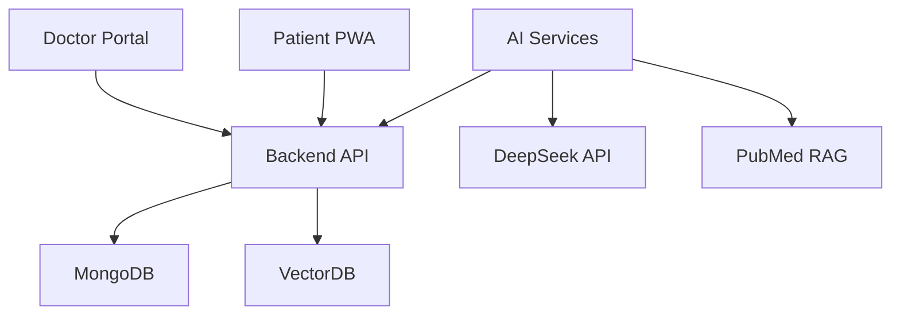
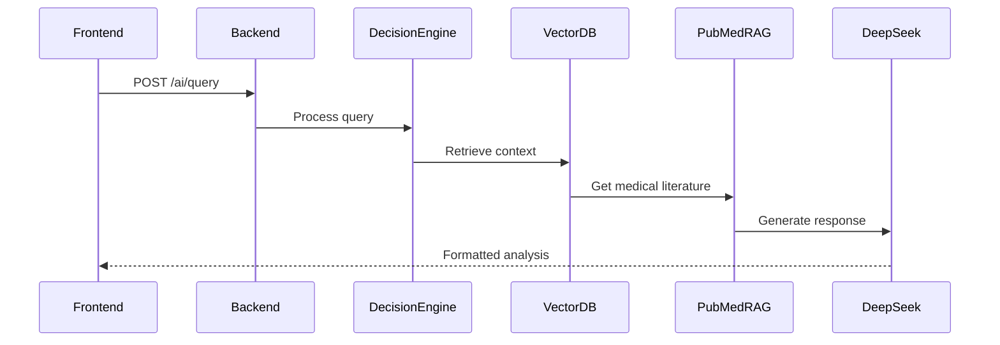

# System Architecture Documentation

## Overview


## Backend Architecture (Flask)
### Core Components:
- **`app.py`**: Main application entry point
- **JWT Authentication**: Role-based access control
- **Endpoint Structure**:
  ```python
  @app.route('/ai/query', methods=['POST'])
  @jwt_required()
  def ai_query():
      # Handles AI analysis requests
  ```

## Frontend Architecture (React)
### Component Structure:
- **Doctor Portal**: 
  - `src/components/PatientAIAnalysis.jsx`
  - `src/components/InteractiveCalendar.jsx`
- **Patient PWA**:
  - `src/components/FilesManagement.jsx`
  - `src/components/VideoCallManager.jsx`

## AI Integration


## Data Flow
1. Patient data uploaded via PWA (`FileUpload.jsx`)
2. Stored in encrypted uploads directory
3. Processed by decision engine (`decision_engine.py`)
4. Context sent to DeepSeek via `ai.py`
5. Responses cached in MongoDB