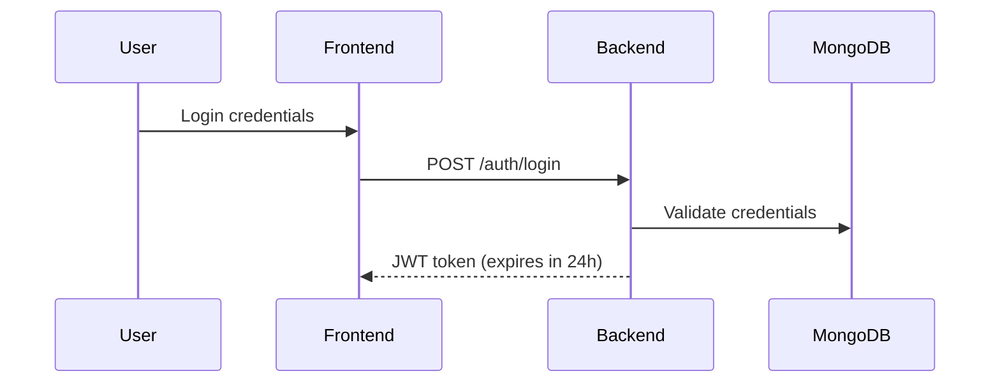

# Security Documentation

## Authentication Flow


## Data Encryption
### File Storage:
```python
# diabetes_backend/utils/file_utils.py
def encrypt_file(file_path):
    # AES-256 encryption implementation
    pass
```

### Environment Configuration:
```env
# .env
ENCRYPTION_KEY=secure_256bit_key_here
```

## HIPAA Compliance
- All PHI encrypted at rest and in transit
- Audit logs for data access
- Role-based access control (RBAC)

## Vulnerability Management
### Dependencies:
```bash
$ pip audit
No known vulnerabilities found
```

### Scanning Tools:
- OWASP ZAP scheduled weekly scans
- Snyk dependency monitoring

## Audit Logging
```python
# diabetes_backend/utils/logger.py
def log_access(user_id, resource, action):
    with open("access.log", "a") as f:
        f.write(f"{datetime.now()}: {user_id} {action} {resource}\n")