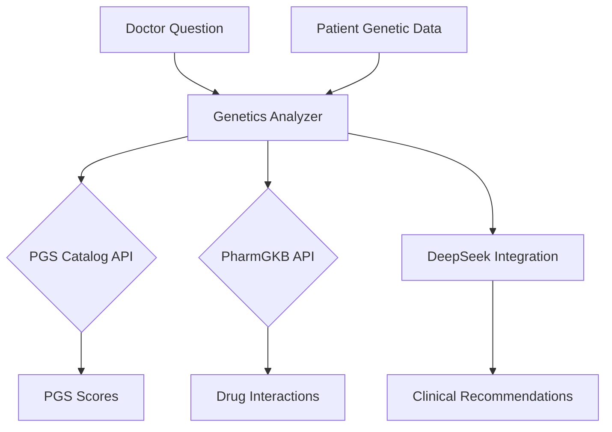

# Genetics API Integration: Comprehensive Report

## 1. Project Vision and Scope
**Vision:** Integrate genetic risk analysis into the Diabetes Management Platform using PGS Catalog and PharmGKB APIs to provide personalized insights for diabetes prevention and treatment.

**Scope:**
- Analyze polygenic risk scores (PGS) for diabetes and related conditions
- Provide pharmacogenomic insights for diabetes medications
- Integrate genetic analysis with existing DeepSeek clinical decision support
- Create clinician-friendly reports with actionable recommendations

## 2. Current Implementation Status
| Component | Status | Details |
|-----------|--------|---------|
| PGS Catalog Integration | ✅ Complete | Basic score retrieval, performance metrics, caching |
| PharmGKB Integration | ✅ Complete | Drug-gene interactions, clinical annotations |
| Genetic Data Extraction | ✅ Complete | OCR processing for SNP count, ancestry, quality |
| DeepSeek Integration | ✅ Complete | RAG system with genetic context |
| Unit Testing | ⚠️ Partial | PGS tests complete, PharmGKB tests pending |
| Production Readiness | ⚠️ Partial | Needs error handling refinement |

## 3. Key Files and Their Roles

### Core Implementation Files:
1. `genetics_analyzer.py`
   - `PGSCatalogClient`: Fetches and ranks PGS scores
   - `PharmGKBClient`: Retrieves drug-gene interactions
   - `GeneticDataExtractor`: Processes OCR text to extract genetic info
   - `DMPGeneticsAnalyzer`: Main integration point with DeepSeek

2. `deepseek_integration.py`
   - `ask_rag_question`: Sends queries to DeepSeek API with genetic context
   - `ask_genetic_question`: Specialized function for genetic analysis

3. `test_genetics_analyzer.py`
   - Unit tests for PGS Catalog functionality
   - Mock API responses and validation

### Supporting Files:
4. `db.py`
   - Database access for patient genetic data (MongoDB)

5. `psgapi.txt`
   - PGS Catalog API documentation and notes

6. `pharmakgbapi.txt`
   - PharmGKB API documentation and notes

## 4. Completed Work
- **API Clients:**
  - Implemented PGS Catalog client with rate limiting and caching
  - Created PharmGKB client for drug-gene interactions
  - Added ancestry-based scoring for PGS results
- **Data Processing:**
  - Developed OCR text analyzer for genetic reports
  - Created prompt engineering for DeepSeek integration
- **Integration:**
  - Connected genetic analysis with DeepSeek RAG system
  - Implemented Flask routes for genetic analysis endpoints
- **Testing:**
  - Created unit tests for PGS functionality
  - Implemented mock API responses for testing
- **Clinical Output:**
  - Defined `SimpleGeneticResult` structure for clinician reports
  - Created risk level classification system

## 5. Next Steps
1. **Complete Testing:**
   - Add unit tests for PharmGKB functionality
   - Implement integration tests with DeepSeek
   
2. **Enhance Error Handling:**
   - Add retry logic for API failures
   - Implement circuit breaker pattern
   
3. **Improve Clinical Relevance:**
   - Add diabetes-specific gene list to PharmGKB client
   - Enhance ancestry matching algorithm
   
4. **Performance Optimization:**
   - Implement asynchronous API calls
   - Add response caching for common queries
   
5. **Security and Compliance:**
   - Add HIPAA-compliant logging
   - Implement data anonymization for genetic data

6. **Deployment:**
   - Create Docker configuration
   - Implement CI/CD pipeline
   - Add monitoring and alerting

## 6. Challenges and Considerations
- **Data Quality:** Genetic insights depend on input data quality (SNP count, ancestry accuracy)
- **API Limitations:** Both PGS Catalog and PharmGKB have rate limits requiring careful management
- **Clinical Validation:** AI-generated recommendations need medical review before production use
- **Ethical Considerations:** Genetic risk reporting requires careful communication to avoid misinterpretation
- **Performance:** Genetic analysis adds latency to clinical decision workflow

## Recommendation
The implementation is ready for limited pilot testing with clinicians. Key focus areas for initial feedback:
1. Quality of DeepSeek-generated recommendations
2. Usefulness of pharmacogenomic insights
3. Clarity of risk visualization